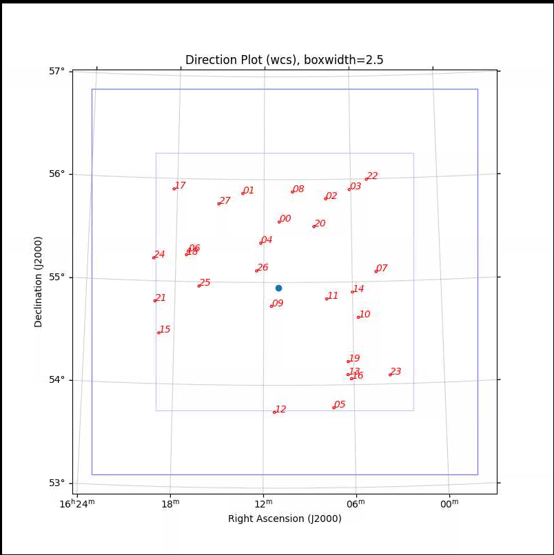
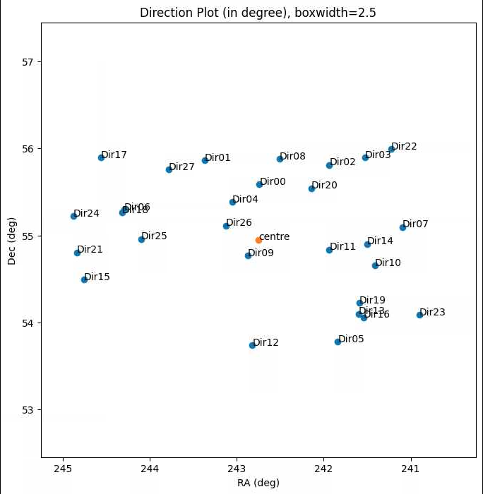
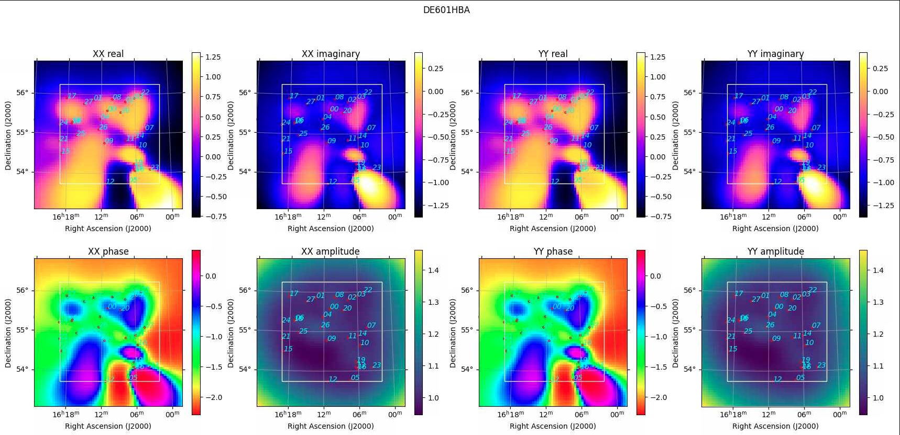
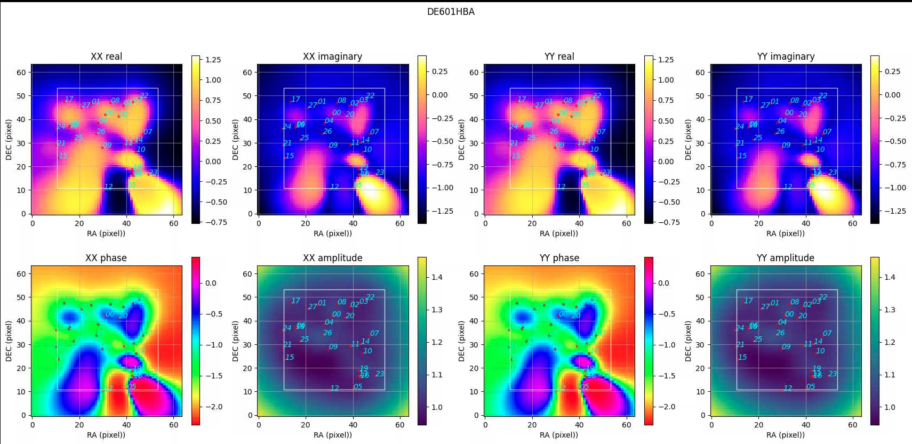

# lb_scripts
Long Baseline Scripts

## Usage of Plot_dirandscreen.py 

This script can
1) Display selfcal directions from your merged h5parms, which is helpful to choose the parameter --boxwidth required by later screen-making script (Reinout's make_gainscreenv2.py)
2) Display screen .fits file for each antenna. The screen .fits file is made using Reinout's make_gainscreenv2.py
3) Provide a list of h5parm names with the given directions

---

1) Before making your screen:
```
python3 Plot_dirandscreen.py --H5file merged_FILE_name.h5 --RA 242.75 --DEC 54.95

```
where --RA and --DEC is the field centre, so you don’t have to feed a .ms file or a screen .fits file.

You will get two direction plots, one in degrees, one in wcs framework

```
python3 Plot_dirandscreen.py --H5file merged_FILE_name.h5 --RA 242.75 --DEC 54.95

```
where --RA and --DEC is the field centre, so you don’t have to feed a .ms file or a screen .fits file.

You will get two direction plots, one in degrees, one in wcs framework. Here is an example:





2) After making your screen:

```
python3 last_version.py --FITSscreen gainscreen_rbf_2.5.fits --H5file merged_selfcalcyle_2022feb.h5 --plot_pix True --plot True

```

A directory called 'screen_plots' would be created under the current directory, with the screen images saved for each antenna. Here are two examples for the antenna DE601HBA





3) If you want to drop some of your directions:


```
python3 Plot_dirandscreen.py --H5file h5file --H5file_ind merged_selfcalcyle

```

where 'merged_selfcalcycle' are the first series of letters of the individual h5 parms that can be distinguished from other h5parms. A h5_names.txt file would be created under the screen_plots directory as well. Its content includes lists similar to this:

[0, '161057.22+553518.10', 'merged_selfcalcyle003_ILTJ161057.72+553527.9_concat.ms.avg.h5'], 

meaning Dir00 is at 161057.22+553518.10, the h5parm containing this direction is named as 161057.22+553518.10


